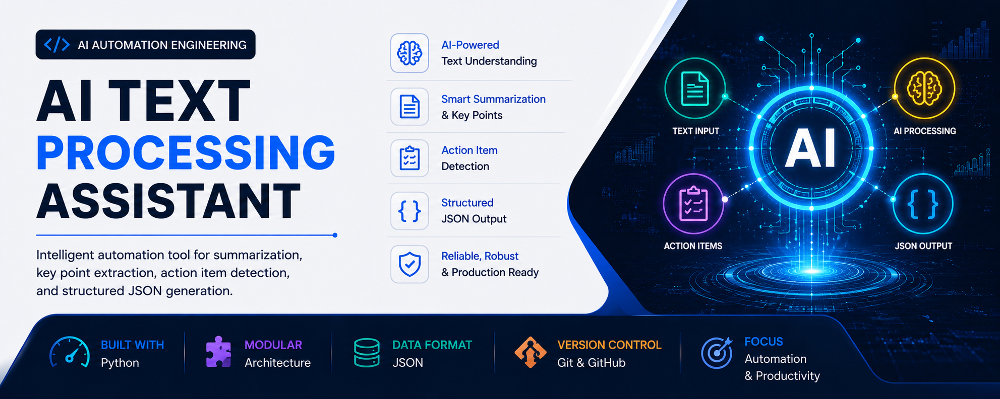

<p align="center">
  
</p>

<h1 align="center">🤖 AI Text Processing Assistant</h1>

<p align="center">
Production-Style AI Automation Project for Intelligent Text Analysis, Prompt Engineering, and Structured Data Processing
</p>

<p align="center">


</p>

---

## 📖 Overview

A production-style AI Text Processing Assistant developed as part of the **AI Automation & Workflow Engineering** learning journey.

The application processes unstructured meeting notes using a Local Large Language Model (LLM) powered by **Ollama**, generating summaries, extracting key points, identifying action items, converting information into structured JSON, and automatically saving all generated outputs.

---

# 🚀 Features

* AI-powered meeting summarization
* Key point extraction
* Action item extraction
* Structured JSON generation
* Automatic output saving
* Prompt template management
* Centralized logging
* Centralized validation
* Retry mechanism for AI responses
* Local LLM integration using Ollama
* Production-style project architecture

---

# 🏗️ Project Architecture

```
                 User Input
                      │
                      ▼
              Input Validation
                      │
                      ▼
             Prompt Construction
                      │
                      ▼
                Ollama (LLM)
                      │
                      ▼
             AI Generated Output
          ┌────────┼────────┐
          ▼        ▼        ▼
      Summary   Key Points  Action Items
                      │
                      ▼
             Structured JSON
                      │
                      ▼
          Validation & Saving
                      │
                      ▼
             Output Files + Logs
```

---

# 📁 Project Structure

```
AI-Text-Processing-Assistant/

│
├── app.py
├── requirements.txt
├── README.md
├── .env.example
├── .gitignore
│
├── config/
│   └── config.py
│
├── data/
│   └── meeting_notes.txt
│
├── logs/
│   └── application.log
│
├── outputs/
│
├── prompts/
│   ├── summary_prompt.txt
│   ├── key_points_prompt.txt
│   ├── action_items_prompt.txt
│   └── json_prompt.txt
│
├── services/
│   ├── ai_client.py
│   ├── summarizer.py
│   ├── key_points.py
│   ├── action_items.py
│   └── json_generator.py
│
└── utils/
    ├── file_handler.py
    ├── logger.py
    ├── prompt_loader.py
    ├── save_json.py
    ├── save_text.py
    └── validator.py
```

---

# ⚙️ Technologies Used

* Python 3
* Ollama
* Llama 3.2
* OpenAI Python SDK (compatible client)
* python-dotenv
* JSON
* Logging Module
* Git
* GitHub

---

# 📥 Installation

Clone the repository:

```bash
git clone https://github.com/<YOUR_USERNAME>/AI-Text-Processing-Assistant.git
```

Navigate to the project:

```bash
cd AI-Text-Processing-Assistant
```

Create a virtual environment:

```bash
python -m venv .venv
```

Activate the virtual environment.

Windows:

```bash
.venv\Scripts\activate
```

Install dependencies:

```bash
pip install -r requirements.txt
```

Install Ollama and download the model:

```bash
ollama pull llama3.2
```

Create your `.env` file using `.env.example`.

Run the application:

```bash
python app.py
```

---

# 🔄 Application Workflow

1. Read meeting notes.
2. Validate input.
3. Load prompt templates.
4. Send prompts to the local LLM.
5. Generate:

   * Summary
   * Key Points
   * Action Items
   * Structured JSON
6. Validate generated JSON.
7. Save outputs automatically.
8. Generate application logs.

---

# 📄 Sample Output

The application automatically generates:

```
outputs/

summary.txt

key_points.txt

action_items.txt

analysis.json
```

---

# 📚 Learning Outcomes

This project demonstrates practical experience with:

* AI Automation
* Prompt Engineering
* Local Large Language Models
* JSON Processing
* Python Automation
* Logging
* Validation
* Modular Software Design
* AI Workflow Development
* Git & GitHub
* Production-style Project Organization

---

# 🔮 Future Improvements

* SQLite integration
* PostgreSQL support
* REST API
* FastAPI backend
* Streamlit web interface
* Multi-document processing
* Batch processing
* PDF support
* DOCX support
* Docker containerization
* Cloud LLM support
* OpenAI API integration
* RAG (Retrieval-Augmented Generation)

---

# 📄 License

This project is developed for educational and portfolio purposes.

---

# 👨‍💻 Author

**Abdul Qadeer**

Cyber Security Undergraduate

AI Automation & Workflow Engineering Learner

GitHub: https://github.com/qaadeer55
